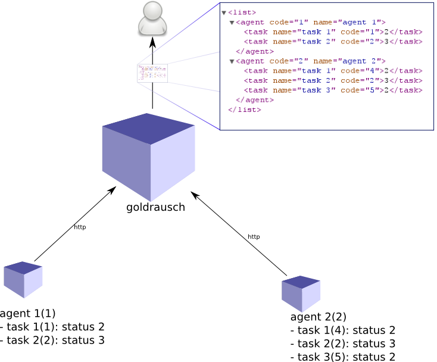

goldrausch
================

alle eingänge (8) am board werden für taster vorgesehen. 
gleiche anzahl ausgänge wird für status leds (8) vorgesehen

message:
wird nur bei event gesendet. nicht konstant. kein polling

jedes board hat ne id
jedes in/output hat auch eine id(nummer) an dem board
status des outputs

Output : /overview 
------------------

hier wird ein XML von den Agenten und Tasks erstellt und angezeigt:

.. code-block:: xml
   :linenos:

   <list>
     <agent code="1" name="agent 1">
       <task name="task 1" code="1">2</task>
       <task name="task 2" code="2">3</task>
     </agent>
     <agent code="2" name="agent 2">
       <task name="task 1" code="4">2</task>
       <task name="task 2" code="2">3</task>
       <task name="task 3" code="5">2</task>
     </agent>
   </list>

Status updates senden : /update
-------------------------------

.. code-block:: bash
   :linenos:

   /update/<agentcode>/<taskcode>/<statuscode>/<secret>

